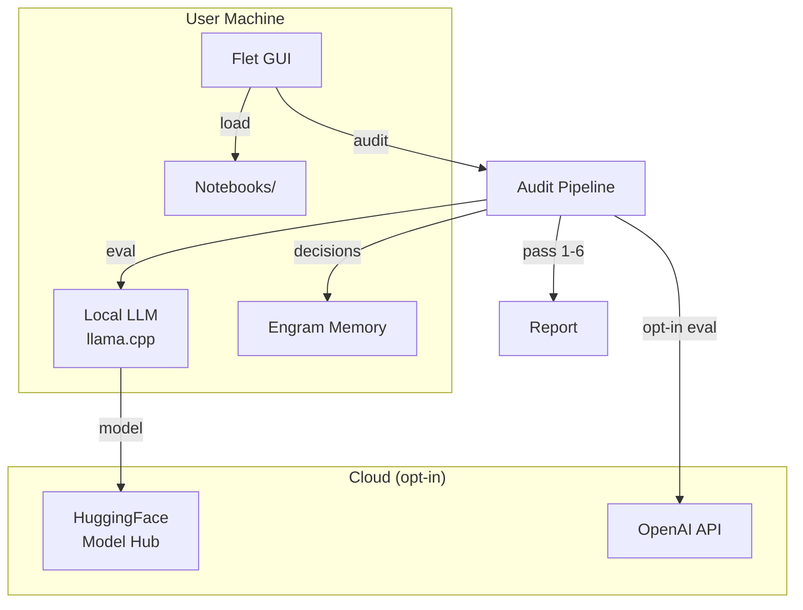
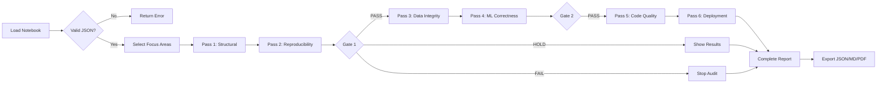
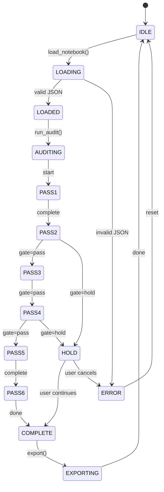
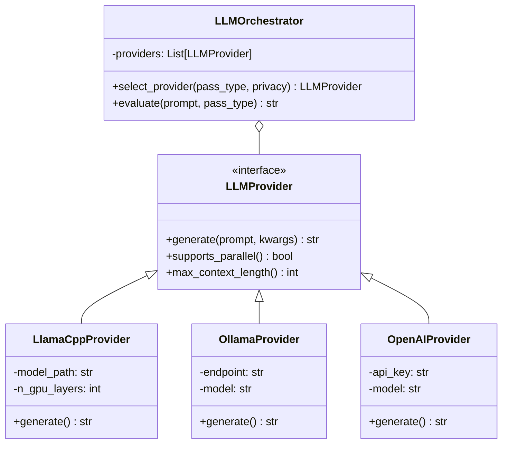

# Paper de Requerimientos — forge-auditAgent

---

## 1. Introducción

### 1.1 Objetivo del Documento
Definir, estructurar y trazar el levantamiento de requerimientos para **forge-auditAgent**, un entorno local y modular de Agentes de IA Generativa orientado a la construcción y auditoría de notebooks computacionales. El documento sigue un proceso de 9 etapas alineado con el protocolo Agentic AI (Goal Definition → HITL) y produce una especificación funcional final trazable a casos de verificación.

### 1.2 Problema que Resuelve
Los notebooks Jupyter (`.ipynb`) son el estándar de facto para data science y ML, pero carecen de garantías de reproducibilidad, auditoría estructurada y control de calidad. Los equipos no tienen una herramienta unificada que:
- Guíe la construcción disciplinada de notebooks (versus estructura ad-hoc)
- Audite sistemáticamente con un protocolo repetible (versus inspección humana aislada)
- Evalúe con LLM-as-a-Judge sin depender exclusivamente de métricas deterministas
- Opere local-first para proteger datos sensibles

### 1.3 Alcance
| Incluye | Excluye |
|---|---|
| Carga y parseo de `.ipynb` locales y GitHub | Integración CI/CD propietaria |
| Construction Framework (3 fases) | Kernels no-Python (R, Julia) |
| Audit Engine (6 pasadas) | Refactorización automática de código |
| LLM Orchestration (Ollama, llama.cpp, OpenAI) | Multi-tenancy SaaS |
| Exportación JSON / MD / PDF | Fine-tuning de modelos LLM |
| Docker sandbox para ejecución aislada | |

### 1.4 Audiencia
- **Equipos de Data Science y ML** que necesitan auditoría reproducible
- **Investigadores** que publican notebooks como parte de sus resultados
- **Arquitectos de software** que diseñan pipelines de LLM locales
- **Revisores** que necesitan un protocolo sistemático de code review para notebooks

---

## 2. Filosofía de Levantamiento para Agentic AI

El levantamiento de requerimientos para un sistema Agentic AI difiere del software tradicional porque el sistema mismo es un **orquestador de agentes autónomos**. La filosofía sigue tres principios:

1. **Local-first por defecto** — los datos del usuario nunca abandonan su máquina sin acción explícita. El levantamiento prioriza componentes offline: inferencia local con `llama.cpp`, almacenaje local de reportes, memoria persistente local (Engram).
2. **Evaluación híbrida** — los chequeos objetivos (existencia de archivos, resolución de dependencias, orden de splits) se resuelven deterministicamente sin LLM. Los criterios subjetivos (calidad de documentación, solidez metodológica) usan LLM-as-a-Judge.
3. **Provider-agnóstico** — el sistema no debe acoplarse a un proveedor de LLM específico. La arquitectura usa un patrón Strategy con interfaz `LLMProvider` unificada, permitiendo intercambiar Ollama, llama.cpp o OpenAI sin cambiar el código del pipeline de auditoría.

---

## 3. Metodología General

El proceso de levantamiento sigue el **ciclo en espiral de Sommerville** (Elicitación → Especificación → Validación) aplicado a cada una de las 9 etapas del workflow Agentic AI:

```
[Elicitación] → [Especificación] → [Validación]
      ↑                              |
      +--- feedback loop ------------+
```

Cada etapa produce:
- **Inputs** formales (documentos, artefactos de etapa anterior)
- **Actividades** concretas con preguntas guía
- **Artefactos** y **entregables** versionados
- **Riesgos** identificados con mitigaciones
- **Criterios de aceptación** medibles

Las 9 etapas mapean directamente a los 8 Building Blocks del protocolo Agentic AI (DraftGuide.pdf) más una etapa inicial de Descubrimiento del Negocio:

| Etapa | Building Block Agentic AI | Propósito |
|---|---|---|
| 1 | Descubrimiento del Negocio | Entender el contexto, stakeholders y problema de negocio |
| 2 | Goal Definition | Definir objetivos medibles y acotados |
| 3 | Task Decomposition | Descomponer en tareas atómicas |
| 4 | Planning | Sintetizar roadmap ejecutable |
| 5 | Tool Integration | Seleccionar capacidades externas |
| 6 | Memory & Context | Gestionar estado y contexto |
| 7 | Decision-Making | Evaluar rutas y resolver incertidumbre |
| 8 | Task Execution | Ejecutar, verificar y auto-corregir |
| 9 | Human-in-the-Loop | Supervisión humana en puntos críticos |

---

## 4. Etapa 1 — Descubrimiento del Negocio

### Objetivos
Identificar el problema de negocio, los stakeholders, el contexto actual de trabajo con notebooks, y las brechas que forge-auditAgent debe cubrir.

### Inputs
- Entrevistas con stakeholders (data scientists, ML engineers, revisores)
- Análisis del flujo de trabajo actual con notebooks
- Documentación de procesos existentes (code review, deployment)
- Repositorios de notebooks existentes

### Actividades
1. Mapear el ciclo de vida actual de un notebook: creación → revisión → producción
2. Identificar puntos de fricción: errores recurrentes, reprocesos, cuellos de botella
3. Clasificar necesidades en deterministas (ej: verificar dependencias) vs subjetivas (ej: calidad de documentación)
4. Priorizar funcionalidades según impacto y viabilidad técnica

### Preguntas
- ¿Cuántos notebooks produce el equipo por semana/mes?
- ¿Qué porcentaje pasa a producción sin revisión estructurada?
- ¿Qué errores son más frecuentes: dependencias, leakage, código repetitivo?
- ¿Usan LLMs actualmente para review? ¿Cuáles?
- ¿Cuál es el límite aceptable de latencia para una auditoría completa?

### Artefactos
- `business-context.md` — descripción del dominio y flujo actual
- `stakeholder-map.md` — matriz de stakeholders con intereses y nivel de involucramiento
- `pain-points.csv` — tabla de puntos de dolor con frecuencia e impacto

### Entregables
- **Business Context Document** (v1.0)
- **Stakeholder Registry** (v1.0)
- **Prioritized Pain Point Matrix**

### Riesgos
| Riesgo | Impacto | Mitigación |
|---|---|---|
| Stakeholders no alineados en prioridades | Alto | Workshop inicial de alineación |
| Subestimación de la diversidad de entornos notebook | Medio | Encuesta técnica previa al diseño |
| Resistencia a adoptar un flujo estructurado | Alto | Demostración rápida con un notebook real del equipo |

### Criterios de Aceptación
- [ ] Stakeholder map validado por al menos 3 roles distintos
- [ ] Pain point matrix con mínimo 10 ítems priorizados
- [ ] Business context document aprobado por el sponsor del proyecto

---

## 5. Etapa 2 — Goal Definition

*Integra el Step 1 del protocolo Agentic AI (DraftGuide.pdf): "Establecer objetivos inequívocos, medibles y estrictamente acotados".*

### Objetivos
Definir los objetivos medibles del sistema forge-auditAgent aplicando SMART criteria, boundary conditioning y failure mode definition.

### Inputs
- Business Context Document (Etapa 1)
- Stakeholder Registry (Etapa 1)
- DraftGuide.pdf — Agentic AI Step 1: Goal Definition

### Actividades
1. **Formalized Prompt Engineering**: Redactar el objetivo primario del sistema usando SMART (Specific, Measurable, Achievable, Relevant, Time-bound)
2. **Boundary Conditioning**: Definir restricciones negativas explícitas — qué NO debe hacer el sistema
3. **Failure Mode Definition**: Pre-definir condiciones que constituyen fallo del workflow

### Preguntas
- ¿Cuál es la métrica principal de éxito del sistema? (ej: % de notebooks que pasan todas las pasadas)
- ¿Qué datos NO deben salir jamás del entorno local?
- ¿Qué constituye un fallo crítico del orquestador?
- ¿Cuánto tiempo máximo debe tomar una auditoría completa para ser útil?

### SMART Goal
> **Specific**: El sistema permitirá a un data scientist cargar un notebook, ejecutar las 6 pasadas de auditoría y obtener un reporte estructurado con riesgo por pasada en ≤120 segundos, usando un modelo local de ≤7B parámetros.
> **Measurable**: Tiempo de auditoría, % de cobertura de pasadas, tasa de falsos positivos/negativos en hallazgos.
> **Achievable**: Implementación incremental: primero 6 pasadas deterministicas, luego integración LLM.
> **Relevant**: Resuelve la falta de auditoría estructurada identificada en Etapa 1.
> **Time-bound**: MVP funcional en 8 semanas (según InitialProposalDev.md).

### Boundary Conditioning
| Restricción Negativa | Razón |
|---|---|
| No enviar datos del notebook a ningún servicio cloud sin confirmación explícita | Privacidad de datos del usuario |
| No modificar el notebook original | El sistema es diagnóstico, no prescriptivo |
| No ejecutar código no verificado fuera del sandbox Docker | Seguridad y aislamiento |
| No depender de un único proveedor LLM | Resiliencia y libertad de elección |

### Failure Mode Definition
| Modo de Fallo | Trigger | Acción |
|---|---|---|
| Timeout de auditoría | >300 segundos sin completar | Cancelar pipeline, reportar error parcial |
| LLM provider no responde | >30 segundos sin respuesta | Fallback a otro provider o modo deterministic-only |
| Notebook inválido | JSON mal formado o estructura faltante | Retornar error descriptivo, no crash |
| Archivo no encontrado | Path inexistente | Error claro con path sugerido |

### Artefactos
- `smart-goal.md` — objetivo SMART firmado
- `boundary-conditions.md` — matriz de restricciones negativas
- `failure-modes.md` — tabla de modos de fallo con triggers y acciones

### Entregables
- **Goal Definition Document** (v1.0)
- **System Boundary Map**

### Riesgos
| Riesgo | Impacto | Mitigación |
|---|---|---|
| Objetivo SMART demasiado ambicioso para 8 semanas | Alto | Dividir en MVP + releases posteriores |
| Boundary conditions demasiado restrictivas | Medio | Revisión trimestral de restricciones |
| Failure modes incompletos en primera iteración | Medio | Sistema de logging para identificar modos no cubiertos |

### Criterios de Aceptación
- [ ] SMART goal aprobado por stakeholder clave
- [ ] Boundary conditions documentadas y acordadas
- [ ] Failure mode table con ≥6 modos identificados

---

## 6. Etapa 3 — Task Decomposition

*Integra el Step 2 del protocolo Agentic AI (DraftGuide.pdf): "Descomposición sistemática de objetivos complejos en subtareas atómicas".*

### Objetivos
Descomponer el SMART goal en tareas atómicas, lógicamente secuenciadas, con dependencias explícitas y granularidad controlada.

### Inputs
- Goal Definition Document (Etapa 2)
- PRD-AgenticAI-Modular.md (funcionalidades identificadas)
- InitialProposalDev.md (timeline y fases)

### Actividades
1. **Recursive Prompting**: Aplicar razonamiento jerárquico para descomponer el sistema en módulos
2. **Dependency Mapping**: Identificar prerequisitos y dependencias entre subtareas
3. **Granularity Control**: Verificar que cada tarea no sea ni demasiado amplia ni demasiado atómica

### Descomposición

**Nivel 0 — Sistema:** forge-auditAgent

**Nivel 1 — Módulos:**
| Módulo | Depende de | Descripción |
|---|---|---|
| M1: Notebook Loader | — | Carga y parseo de .ipynb local y GitHub |
| M2: Construction Workbench | — | Guía de 3 fases para autoría |
| M3: Audit Engine | M1 | 6 pasadas de auditoría secuenciales |
| M4: LLM Orchestration | — | Strategy pattern para providers |
| M5: Export & Reporting | M3 | Exportación JSON/MD/PDF |
| M6: Sandbox Execution | M3 | Ejecución aislada en Docker |
| M7: GUI Desktop | M1–M5 | Interfaz Flet con 6 tabs |
| M8: Full-Stack Web | M1–M6 | Frontend React + Backend FastAPI (futuro) |

**Nivel 2 — Tareas atómicas (extraído del SDD tasks original):**
- T1.1: Package marker + estructura app/audit/
- T1.2: Notebook model (Cell, Notebook dataclasses)
- T1.3: Loader: local filesystem
- T1.4: Loader: GitHub raw URL
- T2.1: Pass 1 — Structural Overview
- T2.2: Pass 2 — Reproducibility Check
- T2.3: Pass 3 — Data Integrity Review
- T2.4: Pass 4 — ML Correctness Audit
- T2.5: Pass 5 — Code Quality Review
- T2.6: Pass 6 — Deployment Readiness
- T3.1: AuditPipeline orchestrator
- T3.2: Progress callback mechanism
- T4.1: Export JSON
- T4.2: Export PDF
- T4.3: Export MD
- T5.1: UI — Notebook DB scanner
- T5.2: UI — Local path loader
- T5.3: UI — GitHub URL loader
- T5.4: UI — Focus area selector
- T5.5: UI — Results display with expansion tiles
- T6.1: LLMProvider interface
- T6.2: llama.cpp integration
- T6.3: Ollama integration
- T6.4: OpenAI integration

### Artefactos
- `task-decomposition.md` — árbol jerárquico completo (N0→N2)
- `dependency-graph.md` — grafo de dependencias entre módulos

### Entregables
- **Work Breakdown Structure (WBS)** v1.0
- **Dependency Matrix**

### Criterios de Aceptación
- [ ] Cada tarea tiene un entregable único identificable
- [ ] Dependencias entre tareas validadas por el arquitecto
- [ ] WBS cubre todos los módulos del PRD

---

## 7. Etapa 4 — Planning

*Integra el Step 3 del protocolo Agentic AI (DraftGuide.pdf): "Sintetizar tareas descompuestas en un roadmap dinámico y ejecutable".*

### Objetivos
Sintetizar las tareas descompuestas en un plan de ejecución con secuencia temporal, asignación de recursos, caminos alternativos y protocolos de fallback.

### Inputs
- WBS (Etapa 3)
- InitialProposalDev.md (timeline 8 semanas)
- PRD-AgenticAI-Modular.md

### Actividades
1. **Plan-and-Solve**: Generar blueprint de ejecución paso a paso
2. **DAG Planning**: Representar el workflow como DAG para manejar dependencias no lineales
3. **Fallback Embedding**: Pre-definir caminos alternativos para bottlenecks

### Plan de Ejecución (DAG simplificado)

```
Semana 1-2: Entorno y Base
  M1 (Loader) ──→ M7 (GUI Desktop)
  └──→ tests

Semana 3-4: Pipeline de Auditoría
  M3 (Audit Engine) ──→ M5 (Export)
  └──→ tests

Semana 5-6: LLM y Sandbox
  M4 (LLM Orchestration)
  M6 (Sandbox Execution)
  └──→ tests

Semana 7-8: Integración y QA
  M1 + M3 + M4 + M7 → integración end-to-end
  └──→ validación con notebooks reales
```

### Recursos
| Recurso | Asignación |
|---|---|
| 1 desarrollador backend | M1, M3, M4, M6 |
| 1 desarrollador frontend | M7, M5 |
| 1 GPU (para pruebas de inferencia local) | Compartida |

### Fallback Protocols
| Escenario | Plan B |
|---|---|
| llama.cpp no compila en plataforma target | Usar Ollama como backend local primario |
| OpenAI API rate-limited | Cachear respuestas, reintentar con backoff exponencial |
| Docker no disponible | Ejecución directa con venv aislado (modo degraded) |
| Flet 0.85.x sin soporte de control X | Postergar feature o reemplazar por TextField |

### Artefactos
- `implementation-roadmap.md` — plan por semanas con milestones
- `dag-workflow.md` — grafo acíclico dirigido del plan
- `fallback-plan.md` — tabla de contingencias

### Entregables
- **Implementation Roadmap** v1.0 (8 semanas)
- **Resource Allocation Matrix**

### Criterios de Aceptación
- [ ] Roadmap aprobado por el equipo de desarrollo
- [ ] Fallback plans documentados para ≥4 escenarios críticos
- [ ] DAG validado: no hay ciclos en dependencias

---

## 8. Etapa 5 — Tool Integration

*Integra el Step 4 del protocolo Agentic AI (DraftGuide.pdf): "Matching dinámico de subtareas con capacidades externas óptimas".*

### Objetivos
Seleccionar y configurar las herramientas y proveedores externos que el sistema necesita: LLM providers, storage, formato de reportes, y plataforma GUI.

### Inputs
- Implementation Roadmap (Etapa 4)
- Análisis de proveedores LLM disponibles

### Actividades
1. **Centralized Tool Registry**: Catalogar todas las herramientas disponibles con capacidades y limitaciones
2. **Strict Parameter Validation**: Definir schemas de datos para inputs/outputs de cada herramienta
3. **Principle of Least Privilege**: Configurar tokens de acceso con alcance mínimo

### Tool Registry

| Herramienta | Propósito | Provider | Autenticación |
|---|---|---|---|
| llama-cpp-python | Inferencia LLM local (in-process) | Local | Ninguna |
| Ollama API | Inferencia LLM local (servicio externo) | Local | API key opcional |
| OpenAI API | Inferencia LLM cloud | Cloud (opt-in) | API key del usuario |
| HuggingFace Hub | Descarga de modelos GGUF | Cloud (opt-in) | Token opcional |
| Flet | GUI desktop multiplataforma | Local | Ninguna |
| Engram | Memoria persistente de decisiones | Local | Ninguna |
| httpx | HTTP para GitHub raw URLs | Cloud (bajo demanda) | Ninguna |

### Provider Strategy Pattern

```
LLMProvider (interfaz abstracta)
├── generate(prompt, **kwargs) → str
├── supports_parallel() → bool
├── max_context_length() → int
│
├── LlamaCppProvider
│   └── servidor in-process, 0 latencia de red
├── OllamaProvider
│   └── API HTTP local, soporta múltiples modelos
└── OpenAIProvider
    └── API cloud, mayor capacidad de juicio
```

### Artefactos
- `tool-registry.md` — catálogo completo de herramientas
- `llm-provider-interface.md` — definición de la interfaz `LLMProvider`
- `auth-matrix.md` — matriz de autenticación por herramienta

### Entregables
- **Tool Registry** v1.0
- **LLMProvider Interface Specification**
- **Authentication Matrix**

### Criterios de Aceptación
- [ ] Tool registry cubre todas las herramientas identificadas
- [ ] Interfaz LLMProvider tiene ≥3 implementaciones concretas
- [ ] Principle of Least Privilege aplicado a cada token/configuración

---

## 9. Etapa 6 — Memory & Context Management

*Integra el Step 5 del protocolo Agentic AI (DraftGuide.pdf): "Gestión continua del flujo de datos contextuales, combinando memoria a corto y largo plazo".*

### Objetivos
Diseñar el sistema de memoria y contexto que permite al orquestador mantener estado coherente a través de las 6 pasadas de auditoría y entre sesiones.

### Inputs
- WBS (Etapa 3)
- Especificación de Engram como sistema de memoria persistente
- Requerimientos de trazabilidad de auditoría

### Actividades
1. **Hybrid Memory Architecture**: Combinar Vector DB (búsqueda semántica) con key-value state tracking
2. **Context Window Compression**: Implementar summarization automático para manejar límites de contexto LLM
3. **State Management**: Variables explícitas de seguimiento de estado del workflow

### Arquitectura de Memoria

| Tipo | Tecnología | Propósito | Persistencia |
|---|---|---|---|
| Working Memory | Variables Python en el pipeline | Estado inmediato de la auditoría en curso | Volátil (sesión) |
| Short-term Context | Engram (mem_get_observation) | Decisiones de la sesión actual | Persistente (por sesión) |
| Long-term Memory | Engram (mem_search, mem_save) | Decisiones arquitectónicas, patrones, bugs fijados | Persistente (cross-session) |
| Audit History | JSON en reports/ | Reportes completos de auditoría | Persistente (archivo) |

### State Machine del Pipeline de Auditoría

```
[IDLE] → load_notebook() → [LOADED] → run_audit()
  → [PASS1] → [PASS2] → [PASS3] → gate?
    → [PASS4] → [PASS5] → [PASS6] → [COMPLETE]
                                       ↓
                                  export() → [EXPORTED]
```

### Context Window Compression
Antes de enviar el notebook completo al LLM para pasadas subjetivas, el sistema debe:
1. Extraer solo las celdas relevantes para la pasada actual
2. Comprimir markdown cells extensos via summarization
3. Preservar execution_count y outputs como metadata estructurada no comprimida

### Artefactos
- `memory-architecture.md` — diseño del sistema de memoria
- `state-machine.md` — diagrama de estados del pipeline
- `context-compression.md` — estrategia de compresión de contexto

### Entregables
- **Memory Architecture Document** v1.0
- **Audit State Machine Specification**

### Criterios de Aceptación
- [ ] Working memory mantiene estado correcto durante 6 pasadas
- [ ] Long-term memory recupera decisiones de sesiones anteriores
- [ ] Context window compression reduce el payload LLM en ≥40% sin pérdida de información crítica

---

## 10. Etapa 7 — Decision-Making

*Integra el Step 6 del protocolo Agentic AI (DraftGuide.pdf): "Evaluar múltiples caminos, manejar incertidumbre y seleccionar acciones óptimas usando razonamiento contextual".*

### Objetivos
Definir cómo el sistema evalúa resultados, resuelve ambigüedades y decide el camino óptimo durante el pipeline de auditoría.

### Inputs
- Audit State Machine (Etapa 6)
- Criterios de evaluación por pasada
- ROBIN-HOOD paper (budget-aware evaluation)
- Metanym Game paper (evaluación multi-turn)

### Actividades
1. Implementar Chain-of-Thought para pasadas que requieren razonamiento profundo
2. Configurar uncertainty quantification: confidence scoring para cada hallazgo
3. Multi-criteria optimization: balancear velocidad vs precisión según configuración del usuario

### Razonamiento por Nivel de Auditoría

| Nivel | Pasadas | Estrategia de Decisión | LLM Requerido |
|---|---|---|---|
| Conceptual | 1–2 | CoT básico + reglas deterministas | No (solo reglas) |
| Metodológico | 3–4 | CoT + confidence scoring | Recomendado |
| Implementación | 5–6 | CoT + Tree-of-Thoughts para hallazgos complejos | Recomendado |

### Gate Decisions
Entre niveles, el sistema puede:
- **PASS**: continuar al siguiente nivel
- **HOLD**: pausar y mostrar resultados parciales al usuario
- **FAIL**: detener la auditoría si se encuentra un blocker crítico

### Uncertainty Quantification
| Hallazgo | Confidence | Acción |
|---|---|---|
| Dependencia faltante | 1.0 (determinista) | Reportar como error seguro |
| Data leakage posible | 0.75 | Reportar como warning, mostrar evidencia |
| Calidad de documentación | 0.6 (subjetivo) | Reportar como suggestion, requerir revisión humana si <0.5 |

### Artefactos
- `decision-framework.md` — framework de decisiones por nivel
- `gate-criteria.md` — criterios de gate entre niveles
- `confidence-scoring.md` — metodología de scoring

### Entregables
- **Decision Framework Document** v1.0
- **Gate Criteria Matrix**

### Criterios de Aceptación
- [ ] Gate decisions son configurables por el usuario (PASS/HOLD/FAIL)
- [ ] Confidence scoring implementado para hallazgos subjetivos
- [ ] Deterministic checks tienen confidence = 1.0 (no requieren LLM)

---

## 11. Etapa 8 — Task Execution

*Integra el Step 7 del protocolo Agentic AI (DraftGuide.pdf): "Ejecutar acciones autónomamente, verificar estado y auto-corregirse basado en feedback del entorno".*

### Objetivos
Definir cómo el sistema ejecuta las pasadas de auditoría, verifica los resultados y se auto-corrige ante fallos parciales.

### Inputs
- Decision Framework (Etapa 7)
- Audit Engine spec (PRD-AgenticAI-Modular.md)

### Actividades
1. **State Verification Loops**: Post-action validation que compara estado actual vs esperado
2. **Automated Rollback**: Protocolos idempotentes para revertir estados parciales
3. **Asynchronous Monitoring**: Tracking de tareas largas con telemetría en tiempo real

### State Verification Loops

```
Por cada pasada:
  1. Ejecutar pasada
  2. Verificar que el resultado contiene todos los campos requeridos
  3. Verificar que el score está en rango (L/M/H o valor numérico)
  4. Si validación falla → reintentar 1 vez → si falla de nuevo → skip con warning
  5. Avanzar a la siguiente pasada
```

### Automated Rollback
| Escenario | Rollback |
|---|---|
| LLM timeout en Pass 3 | Rollback a Pass 2, ofrecer modo deterministic-only |
| FilePicker no disponible en plataforma | Mostrar TextField como fallback (ya implementado) |
| Export falla por falta de permisos de escritura | Intentar directorio alternativo (temp), notificar al usuario |

### Asynchronous Monitoring
- El pipeline ejecuta pasadas secuencialmente pero de forma asíncrona
- Progress callback notifica al UI después de cada pasada completada
- Timeout global de 300 segundos cancela el pipeline completo

### Artefactos
- `execution-protocol.md` — protocolo de ejecución con verification loops
- `rollback-procedures.md` — procedimientos de rollback por escenario
- `monitoring-plan.md` — plan de monitoreo asíncrono

### Entregables
- **Execution Protocol Specification** v1.0
- **Rollback Procedures Manual**

### Criterios de Aceptación
- [ ] Cada pasada ejecuta state verification antes de avanzar
- [ ] Rollback funciona para ≥3 escenarios documentados
- [ ] Progress callback notifica al UI en <500ms por pasada

---

## 12. Etapa 9 — Human-in-the-Loop

*Integra el Step 8 del protocolo Agentic AI (DraftGuide.pdf): "Integrar supervisión humana en puntos críticos para decisiones de alto riesgo, recuperación de errores y alineación ética".*

### Objetivos
Definir los puntos de intervención humana, los triggers de escalación y los mecanismos de feedback para mantener el sistema alineado con la intención del usuario.

### Inputs
- Gate Criteria Matrix (Etapa 7)
- Boundary Conditions (Etapa 2)
- Interactive SDD mode spec

### Actividades
1. **Dynamic Escalation Triggers**: Umbrales que pausan ejecución automáticamente
2. **Explainable Interfaces**: Resúmenes de razonamiento para decisión humana informada
3. **Feedback Incorporation Pipelines**: Capturar e integrar correcciones humanas

### Dynamic Escalation Triggers

| Trigger | Threshold | Acción |
|---|---|---|
| Bajo confidence en hallazgo crítico | <0.7 | Pausar pipeline, mostrar evidencia al usuario |
| Score High en cualquier pasada | Score = "High" | Requerir revisión humana antes de continuar |
| Timeout de LLM | >30s sin respuesta | Notificar al usuario con opción de reintentar o saltar |
| Primer uso del sistema | Primera auditoría | Mostrar tour guiado |
| Detección de datos potencialmente sensibles | PII detectado en celdas | Pausar, preguntar al usuario cómo proceder |

### Explainable Interfaces
Cada hallazgo presentado al usuario debe incluir:
- **Qué se encontró** (descripción del hallazgo)
- **Dónde** (cell index, línea)
- **Por qué es relevante** (impacto potencial)
- **Qué acción se recomienda** (sugerencia de corrección)
- **Confidence** (qué tan seguro está el sistema)

### Feedback Incorporation

```
Usuario recibe hallazgo → decide:
  ├── "Aceptar" → se incluye en el reporte final
  ├── "Descartar" → se marca como false positive (feedback para futuras auditorías)
  └── "Corregir" → se abre el notebook para edición (futuro)
```

### Artefactos
- `escalation-triggers.md` — triggers de escalación dinámicos
- `explainable-interface-spec.md` — especificación de UI explicativa
- `feedback-pipeline.md` — pipeline de incorporación de feedback

### Entregables
- **HITL Specification** v1.0
- **Feedback Pipeline Design**

### Criterios de Aceptación
- [ ] ≥5 escalation triggers implementados con thresholds configurables
- [ ] Cada hallazgo en UI incluye los 5 campos de explainability
- [ ] Feedback del usuario persiste y afecta auditorías futuras

---

## 13. Especificación Funcional Final

La siguiente tabla consolida los requerimientos funcionales extraídos de las 9 etapas, trazables a los Building Blocks del protocolo Agentic AI y a los módulos del sistema.

| ID | Requerimiento | Etapa Origen | Módulo | Prioridad |
|---|---|---|---|---|
| RF-01 | Cargar y parsear `.ipynb` local con validación JSON | E3-Task Decomp | M1 | MUST |
| RF-02 | Cargar notebooks desde GitHub raw URL con auto-conversión | E3-Task Decomp | M1 | MUST |
| RF-03 | Escanear directorio local de notebooks y listar archivos | E3-Task Decomp | M7 | MUST |
| RF-04 | Guía de 3 fases para construcción de notebooks | E2-Goal Def | M2 | SHOULD |
| RF-05 | Ejecutar 6 pasadas de auditoría secuenciales | E3-Task Decomp | M3 | MUST |
| RF-06 | Pass 1: Structural Overview (mapa de secciones, red flags) | E3-Task Decomp | M3 | MUST |
| RF-07 | Pass 2: Reproducibility Check (deps, seeds, paths) | E3-Task Decomp | M3 | MUST |
| RF-08 | Pass 3: Data Integrity (splits, leakage, missing data) | E7-Decision | M3 | MUST |
| RF-09 | Pass 4: ML Correctness (métrica, CV, tuning, baseline) | E7-Decision | M3 | MUST |
| RF-10 | Pass 5: Code Quality (repetición, dead code, naming) | E8-Execution | M3 | SHOULD |
| RF-11 | Pass 6: Deployment Readiness (artefactos, separación, entorno) | E8-Execution | M3 | MUST |
| RF-12 | Evaluación híbrida (determinista + LLM) con confidence scoring | E7-Decision | M3-M4 | MUST |
| RF-13 | 3 providers LLM intercambiables via Strategy Pattern | E5-Tool Int | M4 | MUST |
| RF-14 | Progress callback en tiempo real por pasada | E8-Execution | M3-M7 | MUST |
| RF-15 | Exportación JSON, MD, PDF con reportes completos | E3-Task Decomp | M5 | MUST |
| RF-16 | Gate decisions configurables entre niveles de auditoría | E7-Decision | M3 | SHOULD |
| RF-17 | Escalación HITL por confidence bajo o score High | E9-HITL | M3-M7 | SHOULD |
| RF-18 | Interfaz explicativa con 5 campos por hallazgo | E9-HITL | M7 | SHOULD |
| RF-19 | Feedback del usuario persiste y mejora auditorías futuras | E9-HITL | M4 | COULD |
| RF-20 | Pipeline completo offline sin dependencia cloud | E5-Tool Int | All | MUST |

---

## 14. Checklist de Requerimientos

### Checklist de Verificación Pre-MVP

- [ ] **RF-01** — Carga local de `.ipynb` con validación ✓
- [ ] **RF-02** — Carga GitHub raw URL con auto-conversión ✓
- [ ] **RF-03** — Scanner de directorio notebooks/ ✓
- [ ] **RF-05** — Pipeline de 6 pasadas ejecutable ✓
- [ ] **RF-06** — Pass 1: Structural Overview ✓
- [ ] **RF-07** — Pass 2: Reproducibility Check ✓
- [ ] **RF-08** — Pass 3: Data Integrity ✓
- [ ] **RF-09** — Pass 4: ML Correctness ✓
- [ ] **RF-10** — Pass 5: Code Quality ✓
- [ ] **RF-11** — Pass 6: Deployment Readiness ✓
- [ ] **RF-12** — Evaluación híbrida (determinista + LLM)
- [ ] **RF-13** — 3 providers LLM intercambiables
- [ ] **RF-14** — Progress callback en tiempo real ✓
- [ ] **RF-15** — Exportación JSON, PDF ✓
- [ ] **RF-20** — Offline completo ✓

### Checklist de Verificación Post-MVP

- [ ] **RF-04** — Construction Workbench de 3 fases
- [ ] **RF-16** — Gate decisions configurables
- [ ] **RF-17** — Escalación HITL automática
- [ ] **RF-18** — Interfaz explicativa completa
- [ ] **RF-19** — Feedback pipeline persistente
- [ ] Full-stack web (FastAPI + React + Docker)

---

## 15. Plantillas

### Template: Goal Definition (Etapa 2)

```yaml
goal:
  id: "G-{n}"
  title: "Título del objetivo"
  smart:
    specific: "Qué exactamente"
    measurable: "Cómo se mide"
    achievable: "Por qué es posible"
    relevant: "Por qué importa"
    time_bound: "Cuándo se completa"
  boundaries:
    - "Restricción negativa 1"
    - "Restricción negativa 2"
  failure_modes:
    - trigger: "Condición de fallo"
      action: "Acción de mitigación"
```

### Template: Tool Registry Entry (Etapa 5)

```yaml
tool:
  name: "Nombre de la herramienta"
  purpose: "Propósito principal"
  provider: "Local | Cloud (opt-in) | Cloud (requerido)"
  auth: "Ninguna | API key | Token"
  validation_schema: "URL o referencia al schema"
  limits:
    - "Limitación conocida 1"
    - "Limitación conocida 2"
```

### Template: Audit Finding (Etapa 9)

```json
{
  "finding_id": "F-{n}",
  "pass": 1,
  "cell_index": 5,
  "category": "reproducibility",
  "severity": "error | warning | info",
  "message": "Descripción clara del hallazgo",
  "confidence": 0.95,
  "evidence": "Cita textual del código o metadata",
  "recommendation": "Acción sugerida al usuario"
}
```

### Template: Verification Test Case (Plan de Verificación)

```yaml
test_case:
  id: "TC-{n}"
  req_id: "RF-{n}"
  objective: "Qué se verifica"
  procedure:
    - "Paso 1"
    - "Paso 2"
    - "Paso 3"
  expected_result: "Resultado esperado"
  priority: "High | Medium | Low"
```

---

## 16. Preguntas para Workshops

### Workshop 1 — Descubrimiento (Etapa 1)
1. ¿Cuál es el volumen semanal de notebooks que produce tu equipo?
2. ¿Qué % de esos notebooks pasa a producción sin revisión?
3. ¿Qué errores son más frecuentes en tus notebooks?
4. ¿Usás LLMs actualmente para revisión de código?
5. ¿Cuánto tiempo está dispuesto a esperar por una auditoría completa?
6. ¿Qué datos en tus notebooks son sensibles y no pueden salir de tu máquina?

### Workshop 2 — Goal Definition (Etapa 2)
1. Si el sistema solo pudiera hacer UNA cosa bien, ¿qué debería ser?
2. ¿Qué es innegociable en términos de privacidad de datos?
3. ¿Cuándo considerás que una auditoría "falló" vs "pasó"?

### Workshop 3 — HITL (Etapa 9)
1. ¿En qué punto querés que el sistema te consulte antes de seguir?
2. ¿Preferís revisar todos los hallazgos o solo los críticos?
3. ¿Cómo querés que el sistema te explique por qué encontró un problema?

### Workshop 4 — Priorización
1. De las 6 pasadas, ¿cuáles son las 3 más valiosas para tu equipo?
2. ¿Preferís un MVP con 6 pasadas básicas o 3 pasadas profundas?
3. ¿Cuánto impacto tiene la latencia en tu decisión de adoptar el sistema?

---

## 17. Matriz RACI

| Actividad | Sponsor | Data Scientist | Arquitecto | Desarrollador |
|---|---|---|---|---|
| Definir objetivos de negocio | A | C | R | I |
| Priorizar pasadas de auditoría | I | R | C | C |
| Diseñar arquitectura LLM | I | C | R | C |
| Implementar pipeline de auditoría | I | C | I | R |
| Validar resultados de auditoría | I | R | C | I |
| Definir triggers HITL | C | R | C | C |
| Probar en notebooks reales | I | R | I | C |
| Desplegar y mantener | I | I | C | R |

*R = Responsible, A = Accountable, C = Consulted, I = Informed*

---

## 18. Diagramas Mermaid

### 18.1 Arquitectura de Alto Nivel



### 18.2 Pipeline de Auditoría



### 18.3 State Machine



### 18.4 LLM Strategy Pattern



---

## 19. Ejemplo Completo de un Proyecto

Usando `sample_audit.ipynb` como caso de prueba, el flujo completo sería:

### Paso 1: Cargar Notebook
```
$ python main.py
→ Tab: Audit
→ Click: Scan DB
→ Dropdown: sample_audit.ipynb (auto-loaded)
→ Status: "Loaded: sample_audit.ipynb (4 cells)"
```

### Paso 2: Seleccionar Focus Areas
```
☑ Structural Overview
☑ Reproducibility Check
☑ Data Integrity Review
☑ ML Correctness Audit
☑ Code Quality Review
☑ Deployment Readiness
```

### Paso 3: Ejecutar Auditoría
```
→ Click: Run Audit

Pass 1/6: Structural Overview — PASS
  - 4 cells (1 markdown, 3 code)
  - 1 red flag: cell 3 has null execution_count

Pass 2/6: Reproducibility Check — MODERATE
  - No requirements.txt found
  - Seed set in cell 2: random.seed(42)
  - Risk: MODERATE (missing dep file)

Pass 3/6: Data Integrity Review — PASS
  - No train/test split in notebook → N/A
  - No data loading detected

Pass 4/6: ML Correctness Audit — LOW
  - Simple random sampling, no ML pipeline
  - Score: LOW (no critical issues)

Pass 5/6: Code Quality Review — LOW
  - No repetitive code blocks (>3 threshold)
  - Clear naming, single-purpose cells

Pass 6/6: Deployment Readiness — MODERATE
  - No artifact export detected
  - No environment export file
  - Risk: MODERATE

Audit complete: pass (6 passes)
```

### Paso 4: Exportar Reporte
```
→ Click: Export JSON → sample_audit_20260730_120000.json
→ Click: Export PDF → sample_audit_20260730_120000.pdf
```

### Resultado Esperado
- 6 tarjetas de resultado visibles en el UI
- Cada tarjeta con pass number, pass name, score, finding count
- Hallazgos expandibles con detalle por celda
- Reportes exportados en formato JSON y PDF

---

## 20. Anexos

### A. Referencias

| Documento | Ubicación | Propósito |
|---|---|---|
| PRD-AgenticAI-Modular.md | `reference/docs/mds/` | PRD completo con 8 módulos y 28 FRs |
| Requirements-AgenticAI.md | `reference/docs/mds/` | SRS con 18 FRs, 10 NFRs, 13 TCs |
| DraftGuide.pdf | `reference/docs/pdfs/changes/` | Protocolo Agentic AI (8 building blocks) |
| NotebookBuildAudit.md | `reference/docs/mds/` | Construction + Audit frameworks |
| InitialProposalDev.md | `reference/docs/mds/` | Propuesta comercial y timeline |
| llmOps.md | `reference/docs/mds/` | LLM-as-a-Judge paradigm |
| ROBINHOOD-Metanym-*-Guide.md | `reference/docs/mds/` | Guías de los papers de evaluación |
| agentic-ai-protocol-workflow.pdf | `reference/docs/latex/requirementsDoc/` | Presentación LaTeX del protocolo |
| forge-auditAgent-requirements.pdf | `reference/docs/latex/requirementsDoc/` | Presentación LaTeX de requerimientos |

### B. Glosario

| Término | Definición |
|---|---|
| **Agentic AI** | Sistema autónomo que coordina agentes de IA especializados para completar tareas multi-paso |
| **LLM-as-a-Judge** | Paradigma donde un LLM evalúa outputs de otro modelo usando criterios cualitativos |
| **Construction Framework** | Guía de 3 fases para autoría disciplinada de notebooks |
| **Audit Framework** | Protocolo de 6 pasadas para revisión sistemática de notebooks |
| **Provider Strategy** | Patrón de diseño que permite intercambiar proveedores LLM sin cambiar código cliente |
| **HITL** | Human-in-the-Loop: supervisión humana en puntos críticos del flujo |
| **CoT** | Chain-of-Thought: técnica de prompting que encadena razonamiento paso a paso |
| **ToT** | Tree-of-Thoughts: extensión de CoT que explora múltiples caminos de razonamiento |
| **SMART** | Specific, Measurable, Achievable, Relevant, Time-bound |
| **WBS** | Work Breakdown Structure: descomposición jerárquica del trabajo |
| **RACI** | Responsible, Accountable, Consulted, Informed: matriz de asignación de responsabilidades |

### C. Log de Cambios

| Versión | Fecha | Cambios |
|---|---|---|
| v1.0 | 2026-07-30 | Versión inicial del paper de requerimientos |

---

*Documento generado siguiendo el proceso de 9 etapas del protocolo Agentic AI (DraftGuide.pdf) y el ciclo en espiral de Sommerville (Elicitación → Especificación → Validación).*
